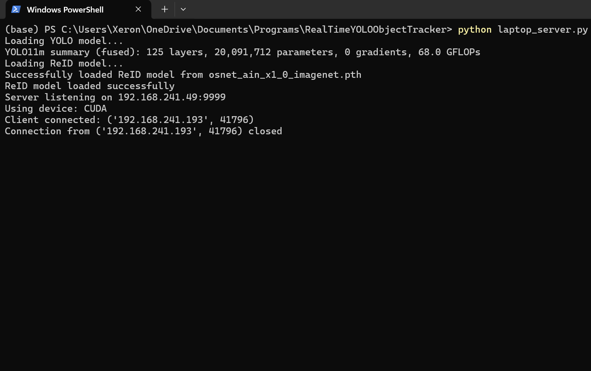

# Mobile Real Time YOLO Object Tracker with Re-Identification

This program is designed to run on Android devices using the Pydroid 3 IDE, leveraging the device's camera for real time object detection, tracking, and re-identification. The system also utilizes a laptop server for the core processing of object detection and tracking.

## Overview

The application is a computer vision tool that turns an Android phone into a real time object tracking device, streaming its camera feed to a laptop server for processing and then receiving the annotated video back for display. It captures video directly from the phone's camera, identifies objects in the video stream, assigns a unique ID to each object, and consistently tracks them as they move across frames.

The core of the application is built on a combination of powerful models and algorithms. It uses **YOLOv11** (specifically `yolo11m.pt` for the server side processing), a state of the art object detection model, to find objects. For tracking, it employs a complex **Re-Identification (ReID)** tracker that leverages the **OSNet** deep learning model. This allows the system to not only track objects by their position but also by their visual appearance, making the tracking far more robust, especially in crowded scenes or during occlusions. The user interface on the phone is built with **Kivy**, providing a responsive display of the video feed and tracking data.

The entire system utilizes multi threading to ensure that the UI remains smooth while heavy processing tasks (on the laptop server) run in the background.

## Features

  * **Real Time Video Streaming**: Streams live video from an Android phone's camera to a laptop over a TCP socket.
  * **Real Time Object Detection**: Utilizes the YOLOv11 model (`yolo11m.pt`) to detect a wide range of objects in real time.
  * **Advanced Re-Identification Tracking**: Implements a custom tracker with the OSNet model to analyze and match the visual appearance of objects, ensuring persistent and accurate tracking even after an object is temporarily lost or occluded.
  * **Mobile First Design (Client)**: Specifically engineered to run on Android devices via the Pydroid 3 IDE, acting as a client for camera capture and display.
  * **Interactive Kivy GUI (Client)**: A clean user interface built with Kivy displays the live camera feed with graphical overlays for tracking information.
  * **Dynamic Visual Feedback**: Each tracked object is highlighted with a uniquely colored bounding box, making it easy to follow individual targets.
  * **Efficient Multi threaded Architecture**: The application uses separate threads for camera capture and network communication on the client, and for handling multiple client connections on the server, to maximize throughput and prevent the UI from freezing.
  * **GPU Acceleration (Server)**: The YOLO and ReID models on the server leverage CUDA for accelerated inference.

## How It Works: Algorithms and Methodology

The application's workflow is divided into several key stages, managed by a multi threaded architecture to ensure real time performance.

### 1\. Object Detection: YOLOv11

The initial step is to locate objects in each frame. The laptop server uses a pretrained **YOLOv11** model (`yolo11m.pt`). The detection is configured with a confidence threshold of 0.3. The model processes frames from the phone client, dynamically setting the image size based on the incoming frame resolution.

### 2\. Object Tracking: Appearance-Based Re-Identification (ReID)

Once objects are detected, they are passed to a custom **Re-Identification (ReID) tracker**. This tracker is significantly more advanced than standard position-based methods (like IOU tracking) because it focuses on the visual appearance of the objects.

  * **Feature Extraction**: For each detected object (like a person), a cropped image of the object is passed to the **`ReIDFeatureExtractor`**. This component uses a pretrained **OSNetAIN** model (`osnet_ain_x1_0_imagenet.pth`) to generate a 512 dimensional feature vector, or "embedding," that numerically represents the object's unique appearance (colors, textures, shapes).
  * **Appearance Matching**: To associate objects between frames, the tracker compares the feature vector of a new detection with the stored feature vectors of existing tracks. This is done using **cosine distance**, which measures the similarity between two vectors. A lower cosine distance means a higher visual similarity.
  * **State Management**: The `TrackState` class maintains the state for each tracked object, including its unique ID, bounding box history, and a running average of its appearance features. This history helps to smooth out predictions and maintain a stable identity.
  * **Robust Association**: The tracker combines both appearance similarity (cosine distance) and positional information (IoU - Intersection over Union) to make a final matching decision. This hybrid approach allows it to re-identify an object that has reappeared after a long occlusion, a common failure point for trackers that rely on position alone.

### 3\. Application Architecture

The program's architecture is designed for concurrency and responsiveness, split between the Android phone client and the laptop server.

  * **Phone Client (`phone_client.py`)**: The `YOLOApp` class runs on the main thread, handling all UI elements, rendering the final video frame, and displaying status text. A dedicated `network_loop` thread continuously attempts to connect to the server, captures frames from the camera, sends them, and receives processed frames back.
  * **Laptop Server (`laptop_server.py`)**: The server listens for incoming client connections. For each connected client, a new thread (`handle_client`) is spawned. This thread receives frames, performs YOLOv11 detection and ReID tracking, annotates the frames, and sends them back to the client.

## File and Folder Structure

For the application to work, your project folder should be structured as follows. You will need to ensure model weights are accessible to the server.

```
MobileRealTimeYOLOObjectTracker/
├── laptop_server.py                    #Main Python application program for the server
├── phone_client.py                     #Main Python application program for the Android client
├── osnet_ain_x1_0_imagenet.pth         #Re-Identification model (must be downloaded)
├── requirements.txt                    #List of Python dependencies for the server
├── bytetrack.yaml                      #The inbuilt bytetrack algorithm of YOlOv11's configurations file
└── ultralytics_config/                 #Directory for Ultralytics configuration (created by server)
```

*Note: The `yolo11m.pt` model is automatically downloaded by Ultralytics when `model = YOLO("yolo11m.pt")` is first run on the server. The `osnet_ain_x1_0_imagenet.pth` model must be manually downloaded.*

## Installation and Usage

Follow these steps to set up and run the project.

### Laptop Server Setup

1.  **Prerequisites**:

      * Python 3.8+
      * CUDA enabled GPU (highly recommended for performance)

2.  **Clone the repository**:

    ```bash
    git clone https://github.com/WhiteMetagross/RealTimeYOLOObjectTracker
    cd RealTimeYOLOObjectTracker
    ```

3.  **Install dependencies**:
    Create a `requirements.txt` file (see example below) and install the dependencies:

    ```bash
    pip install -r requirements.txt
    ```

4.  **Download Models**:

      * **YOLOv11 Model**: The `laptop_server.py` program automatically downloads `yolo11m.pt` if not present. Ensure you have an active internet connection when running the server for the first time.
      * **ReID Model**: You must manually download the `osnet_ain_x1_0_imagenet.pth` model from [the ReID model zoo](https://kaiyangzhou.github.io/deep-person-reid/MODEL_ZOO) and place it in the same directory as `laptop_server.py`.

### Phone Client Setup (Android with Pydroid 3)

1.  **Install Pydroid 3**: Download and install the **Pydroid 3: IDE for Python 3** app from the Google Play Store.
2.  **Grant Permissions**: Grant Pydroid 3 storage and camera permissions when prompted.
3.  **Transfer Project Files**: Download the `phone_client.py` file and place it in a folder on your Android device's internal storage.
4.  **Install Python Dependencies in Pydroid 3**:
    Open Pydroid 3, then use its built-in pip installer to install the necessary libraries. Install each of the following packages one by one via the **LIBRARIES** or **QUICK INSTALL** tab:
      * `kivy`
      * `opencv-python`
      * `numpy`
      * **Note**: `ultralytics` and `torch` (PyTorch) are **not** needed on the phone client.
5.  **Configure `phone_client.py`**: Open `phone_client.py` in Pydroid 3's editor. Locate the `host` variable and set it to the actual IP address of your laptop server.
    Example: `host = '123.456.78.90'`

## Running the Application

1.  **Start the Laptop Server**:
    On your laptop, navigate to the project directory and run:

    ```bash
    python laptop_server.py
    ```

    The server will print the IP address it's listening on (like `Server listening on 123.456.78.90:9999`). Ensure your laptop's firewall allows incoming connections on port `9999`.

2.  **Start the Phone Client**:
    On your Android phone, open `phone_client.py` in Pydroid 3 and press the large yellow "Play" button at the bottom right to run the program.
    The application will attempt to connect to the server and, once connected, will display the live camera feed with object tracking overlays.

3.  **Network Configuration**:
    Ensure both your laptop and phone are on the same WiFi network for communication.
    
    

_The terminal logs of the running laptop server._


## Understanding the On-Screen Display (Client)

The application provides information overlaid on the video feed displayed on the phone.

  * **Bounding Boxes**: Each detected object is enclosed in a rectangle. The color of the rectangle is unique to the object's track ID.
  * **Object Label**: Above the bounding box, you will find a label with detailed information:
      * **ID:{id}**: The unique tracking ID assigned by the ReID tracker.
      * **{class\_name}**: The class of the object detected by YOLOv11.
      * **{conf:.2f}**: The detection confidence score from YOLO, ranging from 0.0 to 1.0.
  * **Status Label**: A status line at the top of the phone screen provides connection status and activity messages (like "Connecting to laptop server...", "Streaming...").


_The phone screen recordings of the running phone client._

## Troubleshooting

  * **Connection Issues**:
      * Verify that both devices are on the same WiFi network.
      * Check that the `host` IP address in `phone_client.py` exactly matches the laptop's IP address.
      * Ensure no firewall is blocking port `9999` on the laptop.
      * Check for "Connection refused" or "Connection lost" messages on the phone; this often indicates an incorrect IP/port or the server not running.
  * **Model Loading Errors**:
      * If the server fails to start with a `FileNotFoundError`, ensure the `osnet_ain_x1_0_imagenet.pth` file is in the correct directory.
  * **Frame Processing Errors**:
      * If the display on the phone freezes or shows errors, check the server's console for messages.
      * Ensure adequate resources (especially the GPU memory) on the laptop for the YOLO and ReID models.
  * **Low Performance**:
      * For the server, a powerful GPU is crucial for real time performance.
      * Adjust JPEG `encode_param` quality (like 85) in `phone_client.py` to balance visual quality and bandwidth usage.
      * Lower `CAP_PROP_FRAME_WIDTH` and `CAP_PROP_FRAME_HEIGHT` in `phone_client.py` to reduce the resolution and frame rate of the streamed video.
